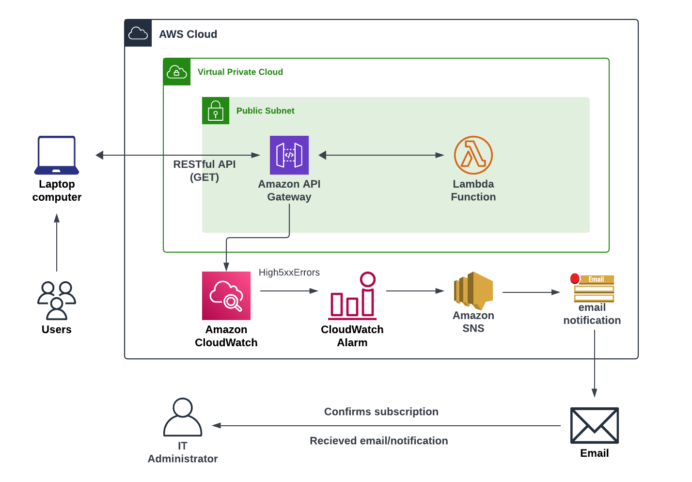
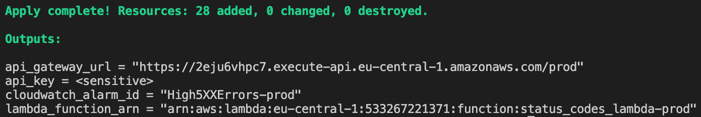
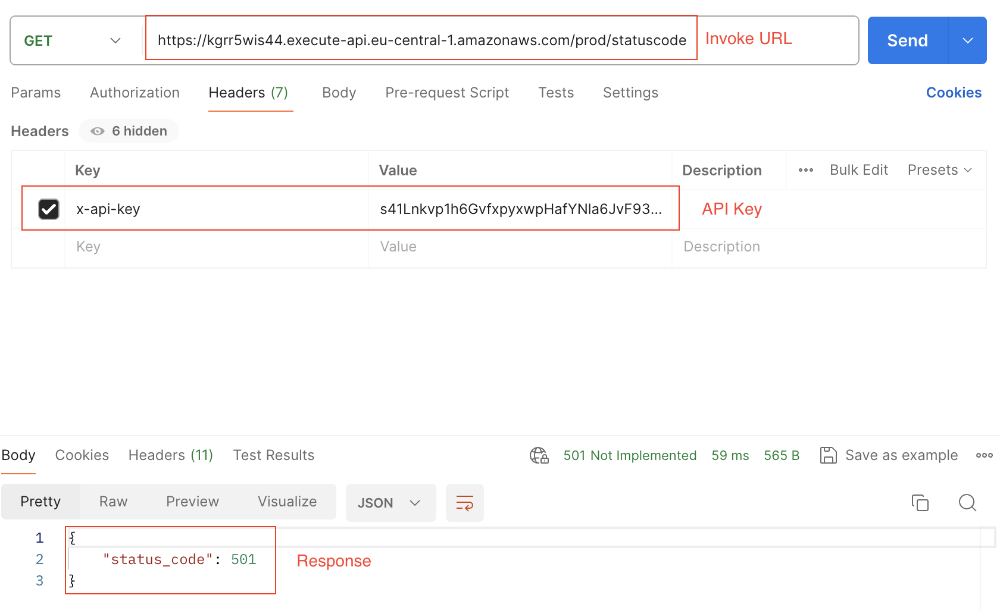

# Infrastructure as Code with Terraform

## 1. Overview

This project sets up a scalable and secure infrastructure on AWS using Terraform. The goal is to automate the deployment of key AWS services, including API Gateway, Lambda, CloudWatch, and S3, ensuring a robust CI/CD pipeline via GitHub Actions.

## 2. Prerequisites

### Software Requirements
- Terraform v1.9.5: Infrastructure as Code tool.
- AWS CLI: To manage AWS services from the command line.
- Git: Version control system.

### AWS Account
Ensure you have an AWS account with the necessary permissions to create IAM roles, API Gateway, Lambda functions, and other resources.

### GitHub Secrets
To enable the CI/CD pipeline, you need to configure the following secrets in your GitHub repository:
- `AWS_ACCESS_KEY_ID`: Your AWS access key ID.
- `AWS_SECRET_ACCESS_KEY`: Your AWS secret access key.

## 3. Architecture Diagram



## 4. Project Structure

- `modules/api_gateway`: Contains the API Gateway configuration.
- `modules/cloudwatch`: Contains the CloudWatch alarm configuration.
- `modules/iam_role`: Contains the IAM role configuration.
- `modules/lambda`: Contains the Lambda function configuration.
- `modules/s3_bucket`: Contains the bucket for Lambda code.
- `modules/sns`: Contains the SNS subscription to inform user when alarm arises.
- `.github/workflows/terraform.yml`: Contains GitHub Actions workflows for CI/CD.

## 5. Setup Instructions

## Clone the repository

   ```bash
   git clone https://github.com/miladaws/eppendorf-devops-challenge
   cd eppendorf-devops-challenge
   ```

## Configuring the Terraform State Backend
To use an S3 bucket and DynamoDB table for Terraform state management and locking, follow these steps:

### 1. set up the S3 bucket name and DynamoDB table name in the code
The S3 bucket name and DynamoDB table must be configured consistently in both the main.tf and terraform.tfvars files:

main.tf in the root:
   ```bash
   terraform {
      backend "s3" {
         bucket         = "YOUR_BUCKET_NAME"              # Replace with the actual bucket name
         ....
         ....
         ....
         dynamodb_table = "YOUR_DYNAMODB_TABLE_NAME"      # DynamoDB table for state locking
      }
   }
   ```

terraform.tfvars in the root:
   ```bash
   # S3 bucket name for state file
   terraform_state_bucket      = "YOUR_BUCKET_NAME"  # Replace with you bucket name

   # DynamoDB table for state locking
   terraform_state_lock_table  = "YOUR_DYNAMODB_TABLE_NAME" # Replace with your DynamoDB table name
   ```

## Configuring SNS Module
The SNS module creates an SNS topic and subscription. The email address for notifications can be customized via the `sns_endpoint` variable.

In the root terraform.tfvars file, specify the email address you want to use for notifications:
terraform.tfvars
```bash
sns_endpoint = "your-email@example.com"
```

### 2. Navigate to the Backend Configuration Directory
This initializes the backend configuration and creates the necessary S3 bucket and DynamoDB table.
   ```bash
   cd backend
   ```

### 3. Navigate to the Backend Configuration Directory
This initializes the backend configuration and creates the necessary S3 bucket and DynamoDB table.
   ```bash
   terraform init
   ```

### 4. pply the Backend Configuration
Apply the configuration to create the S3 bucket and DynamoDB table.
   ```bash
   terraform apply
   ```   

### 5. Return to the Root Directory
Apply the configuration to create the S3 bucket and DynamoDB table.
   ```bash
   cd ..
   ``` 
## Configuring Terraform in the Root Directory

### 1. Initialize Terraform
Initialize Terraform with the new backend configuration. This step ensures that Terraform is configured to use the S3 bucket and DynamoDB table for state management and locking.
   ```bash
   terraform init
   ```

### 2. Deploy the Infrastructure
Apply the configuration to deploy your infrastructure as defined in the root Terraform files.

   ```bash
   terraform apply
   ```

Follow the prompts to confirm and deploy the infrastructure.


### 3. Confirm the subscription to recieve alarm's notification
The owner of the email has to confirm the subscription in order to be able to recieve notification regarding the alarm. 


## Configuring CI/CD with GitHub Actions

### 1. GitHub Actions Setup
Ensure that you have configured the GitHub Actions workflow located in `.github/workflows/terraform.yml`. This workflow automates the Terraform deployment process.

### 2. Setting Up GitHub Secrets
You need to add the following secrets to your GitHub repository to enable the CI/CD pipeline:
- `AWS_ACCESS_KEY_ID`: Your AWS access key ID.
- `AWS_SECRET_ACCESS_KEY`: Your AWS secret access key.

To add these secrets, go to your GitHub repository:

- Navigate to `Settings` > `Secrets and variables` > `Actions`.
- Click New `repository secret` and add each secret with the appropriate name and value.

## 6. Usage

### Testing the API Gateway
Once you have the `api_gateway_url` and `api_key`, you can test your API using tools like curl or Postman. Here’s how you can do it:

### 1. Navigate to the Project Directory:
Navigate to the Project Directory: Make sure you are in the directory where you executed the `terraform apply` command.

### 2. Get the `api_gateway_url` and `api_key`
Once the terraform apply is completed you will get the following in your terminal:


You can also get the variable separately as following:
Run the `terraform output` Command: This command will display the output values defined in your Terraform configuration. 
   ```bash
   terraform output
   ```

For sensitive values like api_key, use the following command to retrieve it securely:

   ```bash
   terraform output -raw api_key
   ```

You should get the following response.

### 3. Make a Request Using using curl or Postman
 Replace <api_gateway_url> with the URL obtained from Terraform output and <api_key> with the API key you retrieved.

   ```bash
   curl -X GET "<api_gateway_url>/statuscode" -H "x-api-key: <api_key>"
   ```

Example:
   ```bash
   curl -X GET "https://2eju6vhpc7.execute-api.eu-central-1.amazonaws.com/prod/statuscode" -H "x-api-key: your-api-key-here"
   ```
You can also use Postman as follow:



## 7. Module Documentation

For detailed documentation on each module, please refer to the following files:

- [CloudWatch Module](docs/cloudwatch.md)
- [SNS Module](docs/sns.md)
- [API Gateway Module](docs/api_gateway.md)
- [Lambda Module](docs/lambda.md)
- [IAM Role Module](docs/iam_role.md)
- [S3 Bucket Module](docs/s3_bucket.md)

## 8. CI/CD Pipeline
GitHub Actions Workflow
The provided GitHub Actions workflow automates the Terraform deployment process, ensuring that any changes to the infrastructure are automatically applied.

## 9. Best Practices
This project adheres to IaC principles, allowing for version-controlled and consistent infrastructure deployments.

Security Considerations
IAM roles are configured with the principle of least privilege to minimize security risks.

## 10. Troubleshooting

Common Issues:

Terraform Init Errors: Ensure your Terraform version matches the required version.
AWS Permission Denied: Verify that your AWS credentials have the necessary permissions.
Logging and Monitoring
CloudWatch logs can be accessed through the AWS console to debug and monitor the deployed services.

## 11. Conclusion
This project automates the deployment of a scalable and secure infrastructure on AWS. Future enhancements could include more sophisticated monitoring, integration with additional AWS services, and more robust CI/CD features.

## 12. Appendix
References
Terraform Documentation
AWS CLI Documentation

## 13. Changelog
See the CHANGELOG.md file for detailed updates.